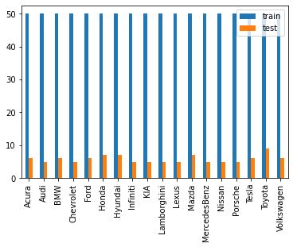
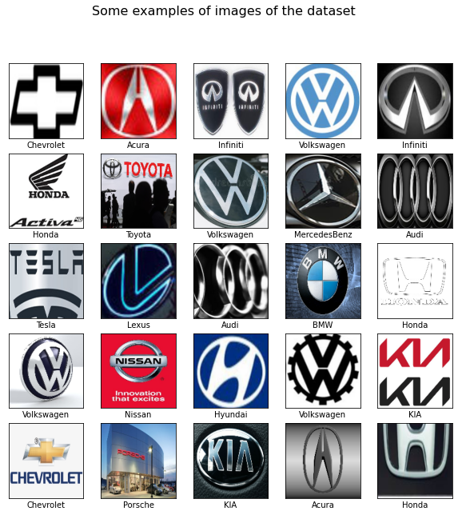
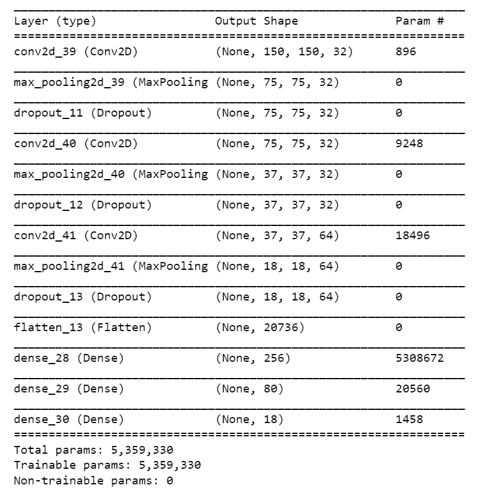
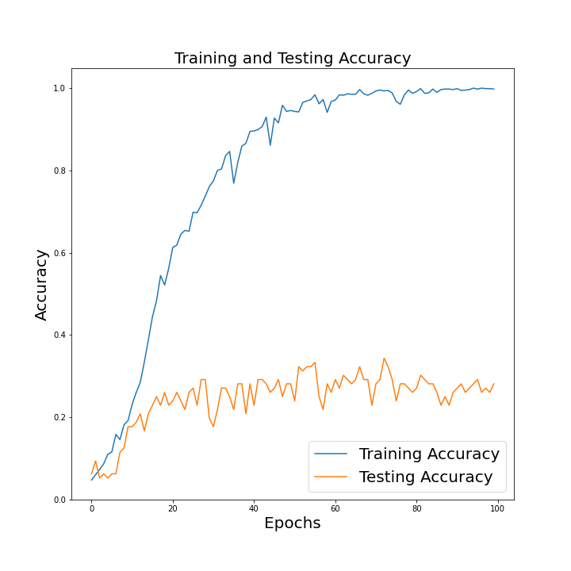
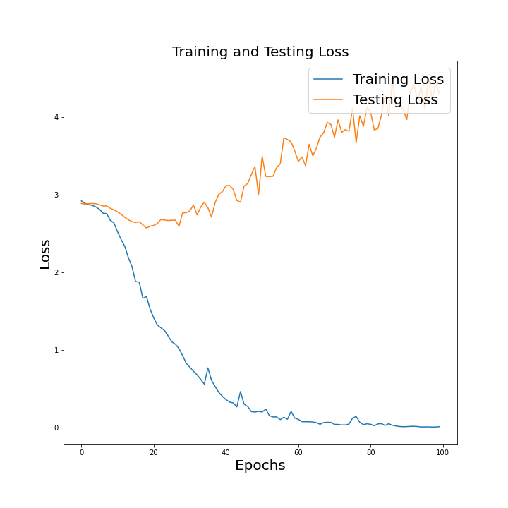
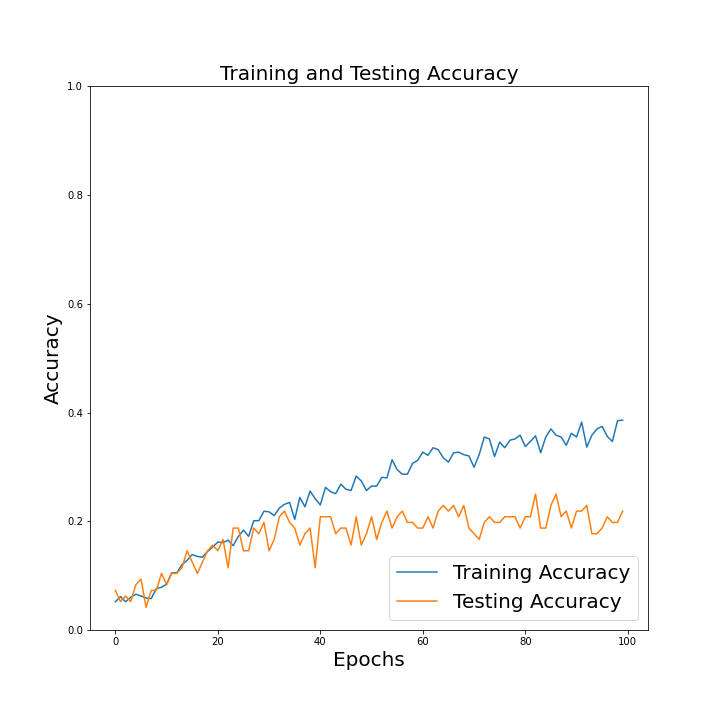
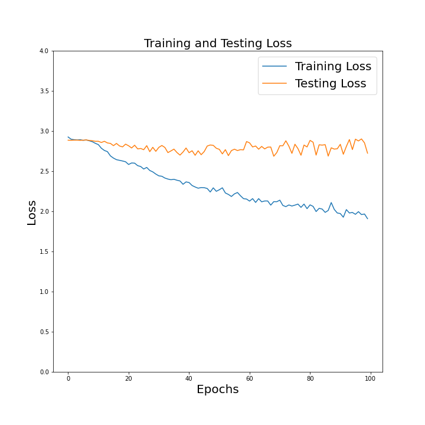

# Logo Detection

Logo detection is vital task in advertisement and sponsorship involving contents like sports broadcasting, entertainment video, news reporting, etc.
Knowing when and where the desired logo appears in a video enables vast
downstream use cases for relevant brands, such as ads insertion, video search,
and clipping services. In this challenge, we have explored convolutional neural network (CNN) for identification of logo and data augmentation using
Keras ImageDataGenerator library to augment images.

# Data Exploration
We explored the dataset and plot distribution of brand-wise train and test
examples. Each vehicle brand

To build the model for logo detection, we have used a dataset of 900 training
images of 18 auto brands, while 5-9 images are hold out for testing. Figure shows the distribution of overall dataset used for model training. The original logo images are resized to shape (150, 150, 3) that is for three channels red, green, and blue. Later, these images are normalized between
range 0 to 1 for faster processing using value 1/255. These resize and normalization operations on images are performed using parameters passed thorough
ImageDataGenerator from keras library.

# Convolutional Neural Network
We use convolutional neural network (CNN) for logo classification. We use
below model architecture for CNN. While there is a scope of hyperparameter
tuning, we limited ourselves with the architecture presented in Fig. 3 due
to limited time availability. However, we would like to note that this model
architecture has been well studied in my previous project on Skin Cancer
Detection using CNN.

# Results and Observations
For our chosen CNN model and without any data augmentation, we observer training accuracy for logo identification model is 99.80%. The final
performance of this CNN model on test data is 23.70%.
Below figure 4a and 4b, shows the plots for accuracy and loss versus every
epochs on training and testing data. With limited training data (< 900
logo images for 18 classes) and moderately complex CNN architecture, we
expected to see the significant gap in loss (and accuracy) of traning vs testing
data. This explains the overfitting problem that our model suffers from.

# Data Augmentation
To increase the size of training data, we explored data augmentation from
ImageDataGenerator from Keras library.

## Rotation
This augmentation method randomly rotates the image clockwise with a set
number of degrees from 0 to 360.
We use rotation range argument of ImageDataGenerator to augments images with random rotations.

## Horizontal and Vertical Shift Augmentation
Here, we intentionally shift images, i.e, move all pixels of the image in one
direction, such as horizontally or vertically, while maintaining the image
dimensions the same.
We use width shift range and height shift range arguments of ImageDataGenerator
to make horizontal and vertical shift.

## Random Zoom Augmentation
With a zoom augmentation, we can randomly zoom in (adds new pixel values
around the image) or zoom out (interpolates pixel values).
We configure image zooming with zoom range argument to the ImageDataGenerator.

For our chosen CNN model and with data augmentation (combined rotation,
horizontal, vertical shift, and zooming), we observed training accuracy for
logo identification model is 39.90%. The final performance of this CNN
model on test data is 21.88%.
Below figure 9a and 9b, shows the plots for accuracy and loss versus every
epochs on training and testing data. With data augmentation, we overcome
the overfitting problem as reflected by the gap between loss (and accuracy)
of model with training vs testing data. Thus, data augmentation is critical performance improvement technique, especially when we have limited
training data. While we limit training the model over 100 epochs, we might
have achieved higher accuracy if we would have trained for a large number
of epochs. In other words, data augmentation may potentially lead longer
training time to improve classification performance.

